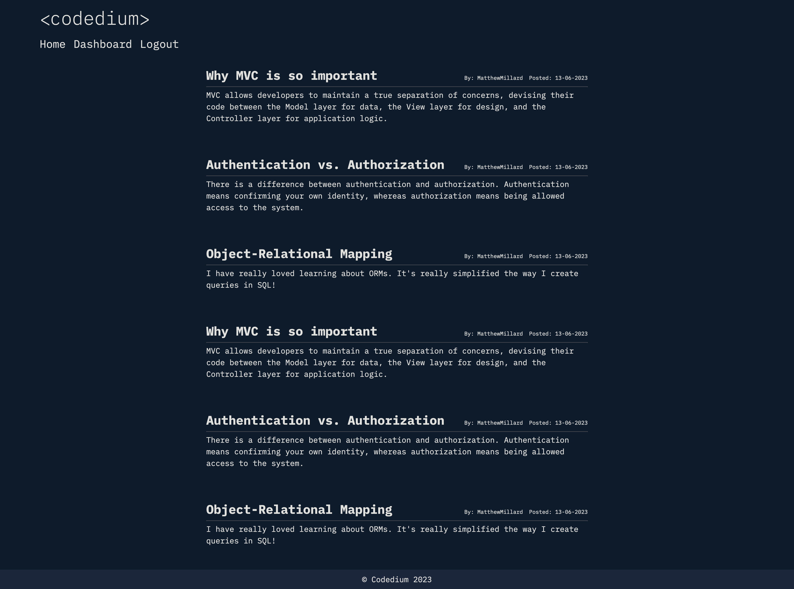

# Codedium

## Description

Codedium is an interactive CMS-style blog platform designed specifically for developers. Think of it as your virtual colloquium, where coders convene to publish, read, and discuss technical concepts, recent advancements, and emerging technologies.

## Table Of Contents

- [Project Setup Guide](#project-setup-guide)
  - [Installation Steps](#installation-steps)
  - [Running the Application Locally](#running-the-application-locally)
- [Links](#links)
[Walkthrough Demonstration](#walkthrough-demonstration)
- [Screenshots](#screenshots)
- [Technologies Used](#technologies-used)
- [Node Packages Used](#node-packages-used)
- [Contributors](#contributors)
- [Contribution](#contribution)
- [License](#license)
- [Questions](#questions)

## Project Setup Guide

### Installation Steps

1. Clone this repository to your local machine.

2. Navigate to the project directory Develop using your preferred terminal or command prompt.

3. Install the project dependencies by running `npm install`.

4. In your MySQL Workbench, create the database using the provided schema.sql file.

5. Seed the database with the command npm run seed.

6. Create a `.env` file and write the following code:

``` JavaScript
DB_NAME='codedium'
DB_USER='your_mysql_server_username'
DB_PASSWORD='your_mysql_password'
SESSION_SECRET='your_secret_string'
```

### Running the Application Locally

With all dependencies installed and the database set up, you can now start the server by running `npm start` in your terminal.

Launch your browser and enter the URL `http//localhost:3001`

## Links

[Github Repository](https://github.com/matthew-millard/codedium)

[Deployed Website](https://codedium.herokuapp.com/)

## Walkthrough Demonstration

[Codium Demonstration Video](https://drive.google.com/file/d/10hJdfZsjIMNxWdXExilKnuaWtR8R6Kcj/view)

## Screenshots



## Technologies Used

- NodeJS

- MySQL

- MySQL Workbench

- Sequelize

- ExpressJS

- Handlebars

- CSS

- HTML

- JavaScript

- VS Code

## Node Packages Used

- sequelize ^6.32.1

- express ^4.18.1

- dotenv ^16.0.3

- mysql2 ^3.3.2

- express-session ^1.17.3

- connect-session-sequelize ^7.1.7

- eslint ^8.42.0

- prettier ^2.8.8

- moment ^2.29.4

- bcrypt ^5.1.0

- nodemon ^2.0.22

## Contributors

[Matthew Millard](https://github.com/matthew-millard)

## Contribution

You're welcome to contribute to this project in several ways: you can help identify and resolve bugs or suggest new features, review and suggest modifications to the code, or enhance the project's documentation. All of these contributions can be made through submitting pull requests.

## License

MIT License A short and simple permissive license with conditions only requiring preservation of copyright and license notices. Licensed works, modifications, and larger works may be distributed under different terms and without source code.

## Questions

If you have any questions related to this project, please don't hesitate to [email me](matthew.richie.millard@gmail.com).

If you would like to check out my other projects on Github: [matthew-millard](https://github.com/matthew-millard).

